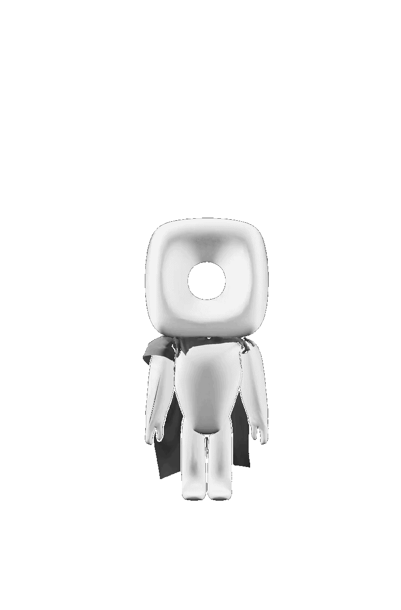

<h1 align="center">Bonjour je suis Kenan KEISER</h1>
<h3 align="center">Un passionné de nouvelles technologies et d'informatiques</h3>

<table border="0">
  <tr>
    <td>
      - 🔭 Je travail actuellement sur un jeux vidéos 3D sur le logiciel godot engine, jeux qui se nomme **Don't look away**  
      - 🌱 J'apprend actuellement à me spécialiser dans l' **informatique en 3ème année de but**  
      - 📝 J'apprend en autodidacte à modéliser en 3D et à animé sur blender ainsi qu'à programmer et créer sur godot engine  
      - 📫 Adresse où me contacter **88kenanvosges88@gmail.com**
    </td>
    <td>
      
    </td>
  </tr>
</table>

<h3 align="left">Réseaux profesionnels:</h3>

<h3 align="left">Langages et outils:</h3>

             

